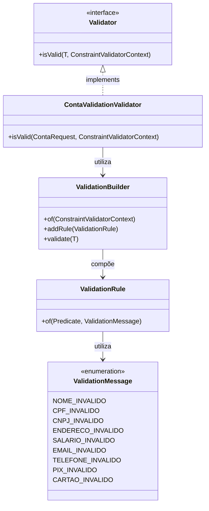

# Poc Fluent Validator

Este projeto é uma prova de conceito (POC) que implementa um validador fluente para validação de dados em Java, utilizando uma abordagem mais elegante e legível para validações.

## Diagrama UML do Fluxo de Validação



## Funcionalidades

- Validação de dados pessoais (nome, CPF, CNPJ)
- Validação de contato (email, telefone)
- Validação de endereço
- Validação de salário
- Validação de chaves PIX
- Validação de cartões de crédito/débito
  - Número do cartão (16 dígitos)
  - Bandeira (obrigatória)
  - Tipo (CREDITO ou DEBITO)
  - Limite (deve ser maior que zero)
  - Data de validade (formato MM/YY)

## Como Usar

### Exemplo de Requisição

```json
POST /api/conta
Content-Type: application/json

{
    "nome": "João Silva",
    "cpf": "123.456.789-00",
    "cnpj": "12345678000190",
    "endereco": "Rua Exemplo, 123",
    "salario": 5000.00,
    "email": "teste@email.com",
    "telefone": "(11) 99999-9999",
    "chavesPix": [
        {
            "tipo": "CPF",
            "valor": "123.456.789-00"
        },
        {
            "tipo": "EMAIL",
            "valor": "joao@email.com"
        }
    ],
    "cartoes": [
        {
            "numero": "1234567890123456",
            "bandeira": "VISA",
            "tipo": "CREDITO",
            "limite": 5000.00,
            "dataValidade": "12/25"
        },
        {
            "numero": "9876543210987654",
            "bandeira": "MASTERCARD",
            "tipo": "DEBITO",
            "limite": 1000.00,
            "dataValidade": "06/24"
        }
    ]
}
```

### Exemplo de Resposta de Sucesso

```json
{
    "status": "SUCCESS",
    "message": "Conta validada com sucesso"
}
```

### Exemplo de Resposta de Erro

```json
{
    "status": "ERROR",
    "message": "Nome inválido: deve ter entre 3 e 50 caracteres"
}
```

## Tecnologias Utilizadas

- Java 17
- Spring Boot
- Jakarta Validation
- Maven

## Como Executar

1. Clone o repositório
```bash
git clone https://github.com/seu-usuario/poc-fluent-validator.git
```

2. Entre no diretório do projeto
```bash
cd poc-fluent-validator
```

3. Execute o projeto
```bash
./mvnw spring-boot:run
```

## Estrutura do Projeto

```
src/main/java/br/kaiofprates/poc_fluent_validator/
├── dto/
│   ├── ContaRequest.java
│   ├── ChavePixRequest.java
│   └── CartaoRequest.java
├── validation/
│   ├── ContaValidationValidator.java
│   ├── ValidationBuilder.java
│   ├── ValidationRule.java
│   └── ValidationMessage.java
└── controller/
    └── ContaController.java
```

## Contribuição

1. Faça um fork do projeto
2. Crie uma branch para sua feature (`git checkout -b feature/nova-feature`)
3. Commit suas mudanças (`git commit -m 'Adiciona nova feature'`)
4. Push para a branch (`git push origin feature/nova-feature`)
5. Abra um Pull Request

## Licença

Este projeto está sob a licença MIT. Veja o arquivo [LICENSE](LICENSE) para mais detalhes. 