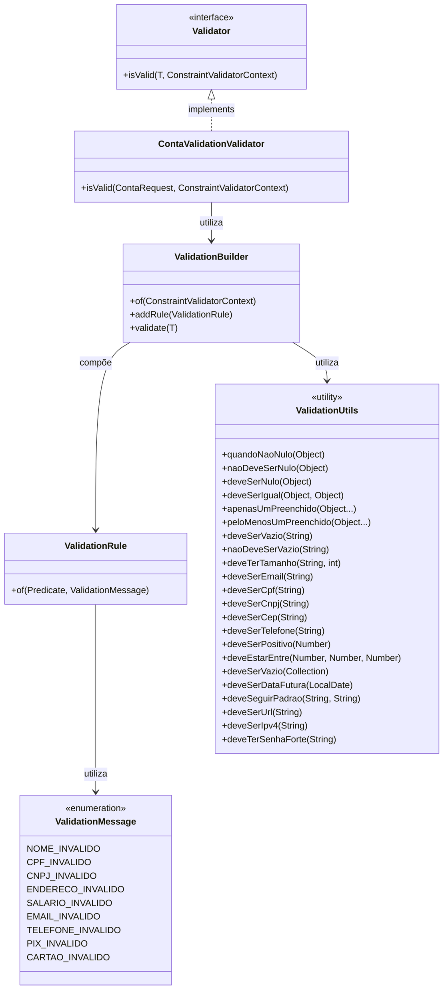

# Poc Fluent Validator

Este projeto é uma prova de conceito (POC) que implementa um validador fluente para validação de dados em Java, utilizando uma abordagem mais elegante e legível para validações. O projeto inclui uma biblioteca abrangente de métodos utilitários de validação (`ValidationUtils`) que podem ser usados em qualquer contexto de validação.

## Diagrama UML do Fluxo de Validação


```mermaid
classDiagram
    class Validator {
        <<interface>>
        +isValid(T, ConstraintValidatorContext)
    }

    class ContaValidationValidator {
        +isValid(ContaRequest, ConstraintValidatorContext)
    }

    class ValidationBuilder {
        +of(ConstraintValidatorContext)
        +addRule(ValidationRule)
        +validate(T)
    }

    class ValidationRule {
        +of(Predicate, ValidationMessage)
    }

    class ValidationMessage {
        <<enumeration>>
        NOME_INVALIDO
        CPF_INVALIDO
        CNPJ_INVALIDO
        ENDERECO_INVALIDO
        SALARIO_INVALIDO
        EMAIL_INVALIDO
        TELEFONE_INVALIDO
        PIX_INVALIDO
        CARTAO_INVALIDO
    }

    class ValidationUtils {
        <<utility>>
        +quandoNaoNulo(Object)
        +naoDeveSerNulo(Object)
        +deveSerNulo(Object)
        +deveSerIgual(Object, Object)
        +apenasUmPreenchido(Object...)
        +peloMenosUmPreenchido(Object...)
        +deveSerVazio(String)
        +naoDeveSerVazio(String)
        +deveTerTamanho(String, int)
        +deveSerEmail(String)
        +deveSerCpf(String)
        +deveSerCnpj(String)
        +deveSerCep(String)
        +deveSerTelefone(String)
        +deveSerPositivo(Number)
        +deveEstarEntre(Number, Number, Number)
        +deveSerVazio(Collection)
        +deveSerDataFutura(LocalDate)
        +deveSeguirPadrao(String, String)
        +deveSerUrl(String)
        +deveSerIpv4(String)
        +deveTerSenhaForte(String)
    }

    Validator <|.. ContaValidationValidator : implements
    ContaValidationValidator --> ValidationBuilder : utiliza
    ValidationBuilder --> ValidationRule : compõe
    ValidationRule --> ValidationMessage : utiliza
    ValidationBuilder --> ValidationUtils : utiliza
```

## Funcionalidades

### Validação de Dados Pessoais
- Nome (3-50 caracteres)
- CPF (formato brasileiro)
- CNPJ (formato brasileiro)

### Validação de Contato
- Email (formato válido)
- Telefone (formato brasileiro)

### Validação de Endereço
- Endereço completo

### Validação Financeira
- Salário (deve ser positivo)
- Chaves PIX (CPF, Email, Celular, Chave Aleatória)
- Cartões de crédito/débito
  - Número do cartão (16 dígitos)
  - Bandeira (obrigatória)
  - Tipo (CREDITO ou DEBITO)
  - Limite (deve ser maior que zero)
  - Data de validade (formato MM/YY)

## ValidationUtils - Biblioteca de Validação

A classe `ValidationUtils` oferece uma ampla gama de métodos utilitários para validação que podem ser usados em qualquer contexto:

### Validações Básicas
```java
// Verificar se valor não é null
ValidationUtils.naoDeveSerNulo(valor);

// Verificar se valor é null
ValidationUtils.deveSerNulo(valor);

// Verificar igualdade
ValidationUtils.deveSerIgual(valor1, valor2);

// Verificar se apenas um valor está preenchido
ValidationUtils.apenasUmPreenchido(valor1, valor2, valor3);

// Verificar se pelo menos um valor está preenchido
ValidationUtils.peloMenosUmPreenchido(valor1, valor2, valor3);
```

### Validações de String
```java
// Verificar se string está vazia
ValidationUtils.deveSerVazio(texto);
ValidationUtils.naoDeveSerVazio(texto);

// Verificar tamanho
ValidationUtils.deveTerTamanho(texto, 10);
ValidationUtils.deveTerTamanhoMinimo(texto, 5);
ValidationUtils.deveTerTamanhoMaximo(texto, 20);
ValidationUtils.deveTerTamanhoEntre(texto, 5, 20);

// Validações específicas brasileiras
ValidationUtils.deveSerEmail("usuario@email.com");
ValidationUtils.deveSerCpf("123.456.789-00");
ValidationUtils.deveSerCnpj("12.345.678/0001-90");
ValidationUtils.deveSerCep("12345-678");
ValidationUtils.deveSerTelefone("(11) 99999-9999");
```

### Validações Numéricas
```java
// Verificar sinais
ValidationUtils.deveSerPositivo(100);
ValidationUtils.deveSerNegativo(-50);
ValidationUtils.deveSerZero(0);

// Comparações
ValidationUtils.deveSerMaiorQue(100, 50);
ValidationUtils.deveSerMenorQue(50, 100);
ValidationUtils.deveSerMaiorOuIgualA(100, 100);
ValidationUtils.deveSerMenorOuIgualA(50, 100);
ValidationUtils.deveEstarEntre(75, 50, 100);

// Lógica de negócio
ValidationUtils.deveSerPar(100);
ValidationUtils.deveSerImpar(99);
ValidationUtils.deveSerDivisivelPor(100, 5);
```

### Validações de Coleções
```java
List<String> lista = Arrays.asList("a", "b", "c");

ValidationUtils.deveSerVazio(lista);
ValidationUtils.naoDeveSerVazio(lista);
ValidationUtils.deveTerTamanho(lista, 3);
ValidationUtils.deveTerTamanhoMinimo(lista, 2);
ValidationUtils.deveTerTamanhoMaximo(lista, 5);
ValidationUtils.deveTerTamanhoEntre(lista, 2, 5);
```

### Validações de Data
```java
LocalDate hoje = LocalDate.now();
LocalDate amanha = hoje.plusDays(1);
LocalDate ontem = hoje.minusDays(1);

ValidationUtils.deveSerDataFutura(amanha);
ValidationUtils.deveSerDataPassada(ontem);
ValidationUtils.deveSerDataHoje(hoje);
ValidationUtils.deveSerDataEntre(hoje, ontem, amanha);
```

### Validações de Padrão
```java
// Regex customizado
ValidationUtils.deveSeguirPadrao("123", "\\d+");

// Tipos de caracteres
ValidationUtils.deveConterApenasNumeros("123456");
ValidationUtils.deveConterApenasLetras("João Silva");
ValidationUtils.deveConterApenasLetrasENumeros("João123");
```

### Validações Específicas
```java
// URLs e IPs
ValidationUtils.deveSerUrl("https://www.google.com");
ValidationUtils.deveSerIpv4("192.168.1.1");

// Senhas
ValidationUtils.deveTerSenhaForte("Senha@123");
```

### Validação Condicional
```java
// Validar apenas se o valor não for null
ValidationUtils.quandoNaoNulo(telefone)
    .entao(() -> ValidationUtils.deveSerTelefone(telefone));

// Ou com boolean direto
ValidationUtils.quandoNaoNulo(email)
    .entao(ValidationUtils.deveSerEmail(email));
```

## Como Usar

### Exemplo de Requisição

```json
POST /api/conta
Content-Type: application/json

{
    "nome": "João Silva",
    "cpf": "123.456.789-00",
    "cnpj": "12345678000190",
    "endereco": "Rua Exemplo, 123",
    "salario": 5000.00,
    "email": "teste@email.com",
    "telefone": "(11) 99999-9999",
    "chavesPix": [
        {
            "tipo": "CPF",
            "valor": "123.456.789-00"
        },
        {
            "tipo": "EMAIL",
            "valor": "joao@email.com"
        }
    ],
    "cartoes": [
        {
            "numero": "1234567890123456",
            "bandeira": "VISA",
            "tipo": "CREDITO",
            "limite": 5000.00,
            "dataValidade": "12/25"
        },
        {
            "numero": "9876543210987654",
            "bandeira": "MASTERCARD",
            "tipo": "DEBITO",
            "limite": 1000.00,
            "dataValidade": "06/24"
        }
    ]
}
```

### Exemplo de Resposta de Sucesso

```json
{
    "status": "SUCCESS",
    "message": "Conta validada com sucesso"
}
```

### Exemplo de Resposta de Erro

```json
{
    "status": "ERROR",
    "message": "Nome inválido: deve ter entre 3 e 50 caracteres"
}
```

## Testes

O projeto inclui uma suíte completa de testes unitários para todos os métodos de validação:

### Executar Testes
```bash
# Executar todos os testes
./mvnw test

# Executar testes específicos
./mvnw test -Dtest=ValidationUtilsTest

# Executar com relatório de cobertura
./mvnw test jacoco:report
```

### Cobertura de Testes
- **ValidationUtils**: 100% de cobertura
- **Validadores de Negócio**: Testes de integração
- **Controllers**: Testes de API

### Estrutura dos Testes
```
src/test/java/br/kaiofprates/poc_fluent_validator/validation/
└── ValidationUtilsTest.java
    ├── ConditionalValidatorTests
    ├── ValidacoesBasicasTests
    ├── ValidacoesStringTests
    ├── ValidacoesNumeroTests
    ├── ValidacoesColecaoTests
    ├── ValidacoesDataTests
    ├── ValidacoesPadraoTests
    ├── ValidacoesLogicaNegocioTests
    └── ValidacoesEspecificasTests
```

## Tecnologias Utilizadas

- **Java 17** - Linguagem principal
- **Spring Boot 3.x** - Framework web
- **Jakarta Validation** - Anotações de validação
- **JUnit 5** - Framework de testes
- **Maven** - Gerenciador de dependências

## Como Executar

### Pré-requisitos
- Java 17 ou superior
- Maven 3.6+

### Passos para Execução

1. Clone o repositório
```bash
git clone https://github.com/seu-usuario/poc-fluent-validator.git
```

2. Entre no diretório do projeto
```bash
cd poc-fluent-validator
```

3. Execute o projeto
```bash
./mvnw spring-boot:run
```

4. Acesse a aplicação
```
http://localhost:8080
```

### Endpoints Disponíveis

- `POST /api/conta` - Validar dados de conta
- `GET /actuator/health` - Health check da aplicação

## Estrutura do Projeto

```
src/
├── main/
│   ├── java/br/kaiofprates/poc_fluent_validator/
│   │   ├── controller/
│   │   │   └── ContaController.java
│   │   ├── dto/
│   │   │   ├── ContaRequest.java
│   │   │   ├── ContaResponse.java
│   │   │   ├── ChavePixRequest.java
│   │   │   ├── CartaoRequest.java
│   │   │   └── RecebedorRequest.java
│   │   ├── exception/
│   │   │   └── ValidationExceptionHandler.java
│   │   ├── validation/
│   │   │   ├── ValidationUtils.java
│   │   │   ├── ContaValidationValidator.java
│   │   │   ├── ValidationBuilder.java
│   │   │   ├── ValidationRule.java
│   │   │   ├── ValidationMessage.java
│   │   │   ├── Validator.java
│   │   │   ├── CartaoValidator.java
│   │   │   ├── ChavePixValidator.java
│   │   │   ├── ChavePixPatterns.java
│   │   │   └── ValidationUtils.java
│   │   └── PocFluentValidatorApplication.java
│   └── resources/
│       └── application.properties
└── test/
    └── java/br/kaiofprates/poc_fluent_validator/
        ├── validation/
        │   └── ValidationUtilsTest.java
        └── PocFluentValidatorApplicationTests.java
```

## Casos de Uso

### 1. Validação de Formulários
```java
public class FormularioValidator {
    public boolean validarFormulario(FormularioRequest request) {
        return ValidationUtils.naoDeveSerNulo(request.getNome()) &&
               ValidationUtils.deveTerTamanhoEntre(request.getNome(), 3, 50) &&
               ValidationUtils.deveSerEmail(request.getEmail()) &&
               ValidationUtils.deveSerCpf(request.getCpf()) &&
               ValidationUtils.deveSerPositivo(request.getIdade());
    }
}
```

### 2. Validação de Configurações
```java
public class ConfigValidator {
    public boolean validarConfig(Config config) {
        return ValidationUtils.deveSerUrl(config.getApiUrl()) &&
               ValidationUtils.deveSerIpv4(config.getDatabaseHost()) &&
               ValidationUtils.deveEstarEntre(config.getPort(), 1024, 65535) &&
               ValidationUtils.deveTerSenhaForte(config.getPassword());
    }
}
```

### 3. Validação de Dados de Negócio
```java
public class PedidoValidator {
    public boolean validarPedido(Pedido pedido) {
        return ValidationUtils.naoDeveSerVazio(pedido.getItens()) &&
               ValidationUtils.deveTerTamanhoMinimo(pedido.getItens(), 1) &&
               ValidationUtils.deveSerPositivo(pedido.getValorTotal()) &&
               ValidationUtils.deveSerDataFutura(pedido.getDataEntrega());
    }
}
```

## Contribuição

1. Faça um fork do projeto
2. Crie uma branch para sua feature (`git checkout -b feature/nova-feature`)
3. Adicione testes para suas funcionalidades
4. Commit suas mudanças (`git commit -m 'Adiciona nova feature'`)
5. Push para a branch (`git push origin feature/nova-feature`)
6. Abra um Pull Request

### Padrões de Código
- Use os métodos da `ValidationUtils` para validações
- Adicione testes unitários para novas funcionalidades
- Mantenha a nomenclatura em português
- Documente métodos complexos

## Licença

Este projeto está sob a licença MIT. Veja o arquivo [LICENSE](LICENSE) para mais detalhes.

## Roadmap

- [ ] Validação de PIS/PASEP
- [ ] Validação de Título de Eleitor
- [ ] Validação de CNH
- [ ] Suporte a validações customizadas
- [ ] Integração com Bean Validation
- [ ] Validação de arquivos (tamanho, tipo, etc.)
- [ ] Validação de coordenadas geográficas
- [ ] Validação de moedas brasileiras 